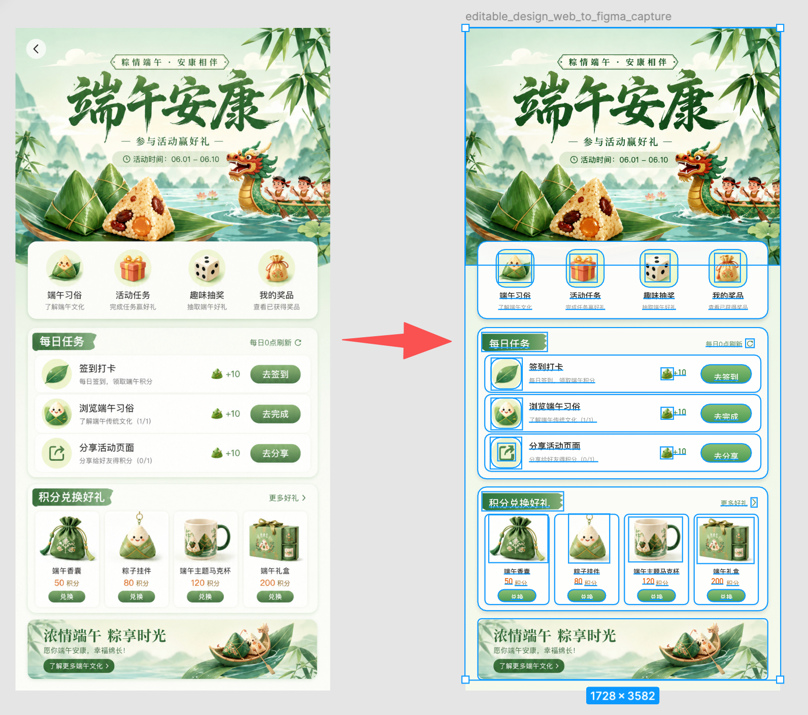
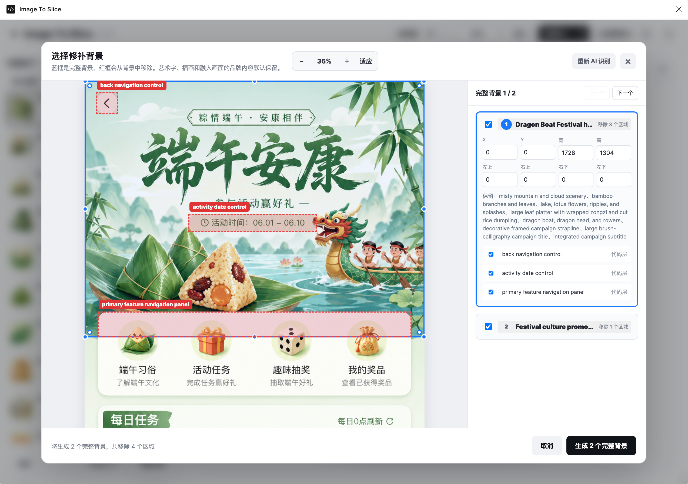
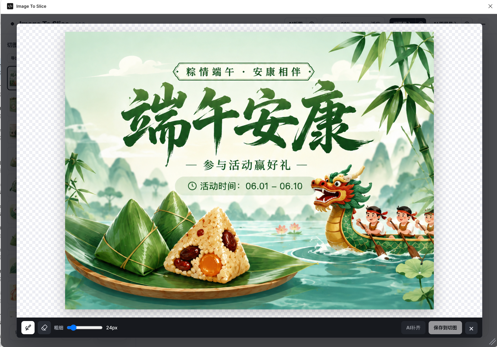
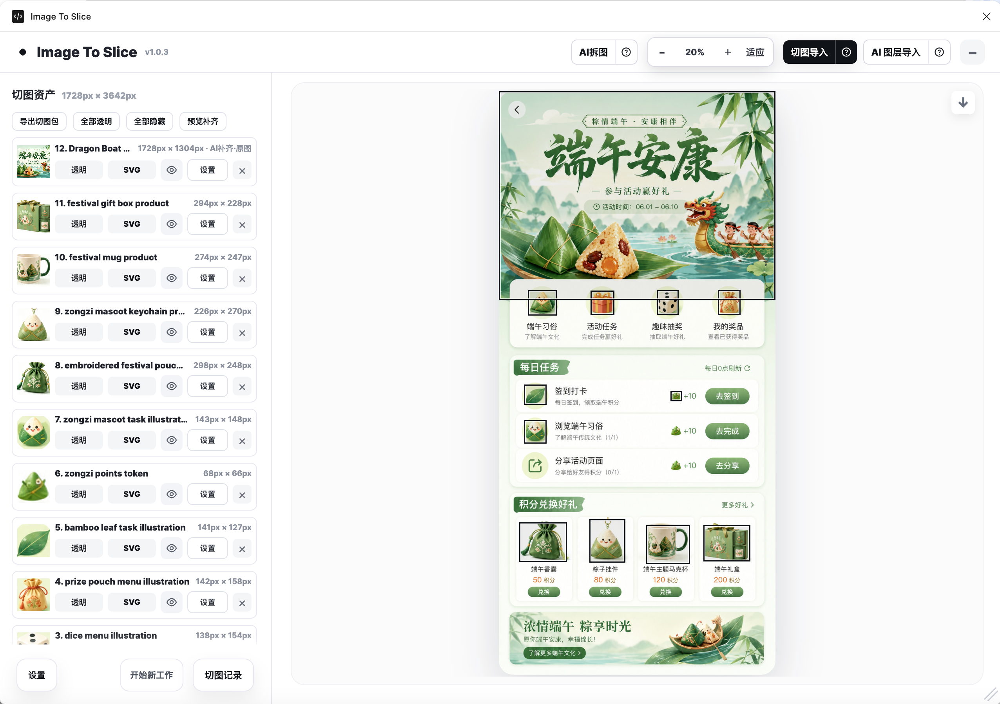
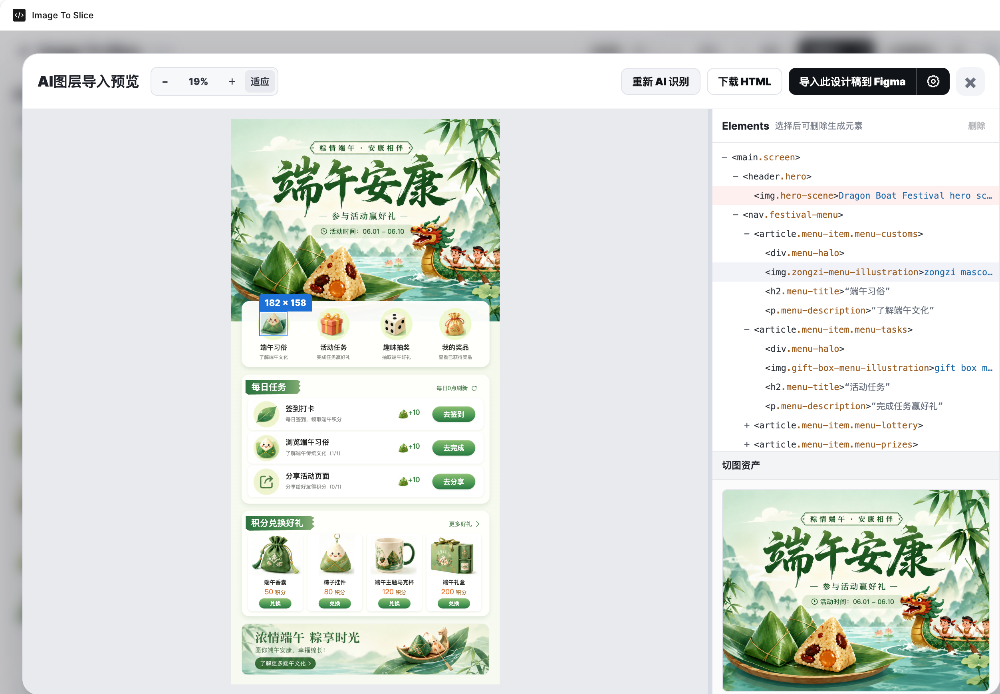
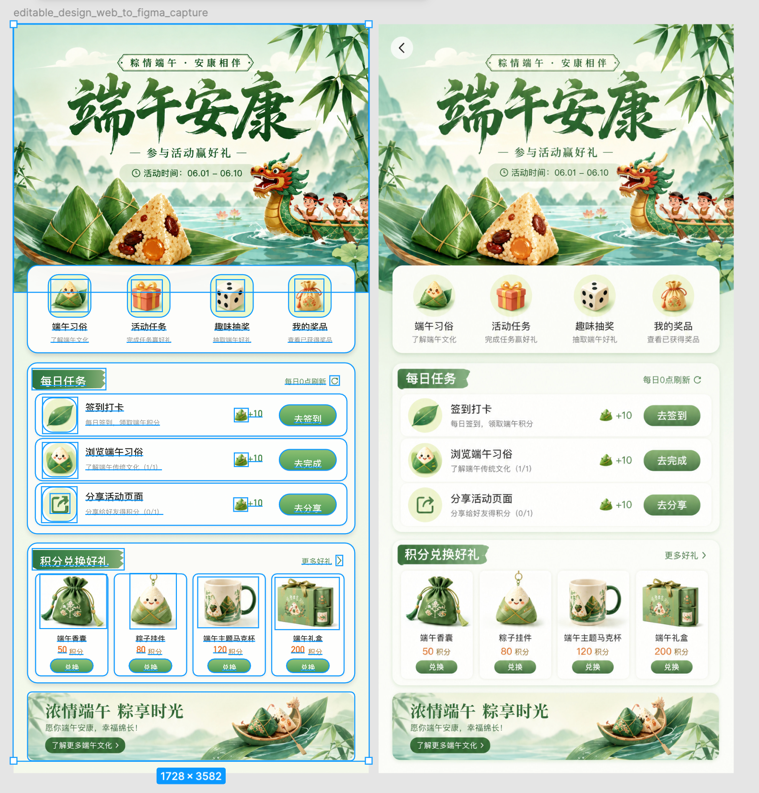
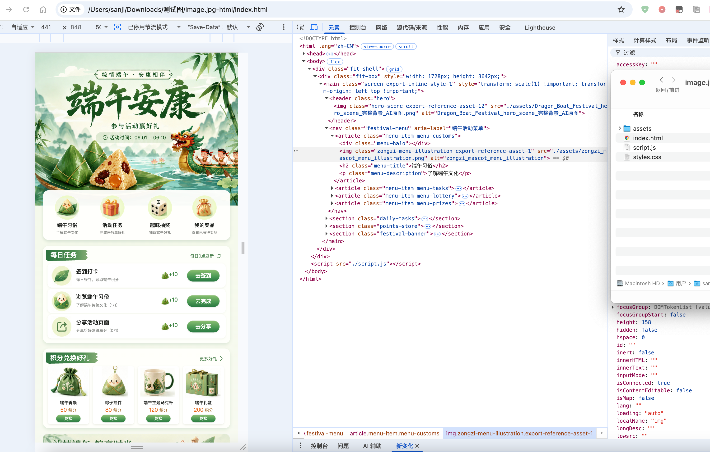

# 简介

Image To Slice 是一个支持 Figma Desktop 插件和独立网页模式的 AI UI 图片拆解与还原工具。

GPT Image2 这类模型生成的 UI 效果图观感确实很不错，但直接丢给 Codex 或者其他大模型做代码还原，输出效果往往惨不忍睹。尤其原图里大量混杂切图素材时，AI
编码很难自动区分哪些元素可以用代码原生实现、哪些只能作为静态切图。
助本插件把设计图拆解为分层结构化元素之后，既可以对接 Figma MCP，也可以直接打包 HTML 再交给 AI 处理，以此摆脱纯靠模型盲猜识别的困境。



## 本项目有什么不同

市面上的图片拆解工具大多以“通用拆图”为目标，主要面向两类需求：

- **AI分层/拆图解决“这张海报应该怎样重新编辑”**：服务于海报、电商等平面设计，让画面元素可以分别编辑，通常导出 PSD 或分层素材。
- **智能抠图解决“我只想留下这个主体”**：本地 SAM 2 结合色域魔棒和画笔，从人物、商品或物体图片中得到透明的独立素材。

但 App、网页和软件界面不仅需要分层，还要判断元素应该如何开发。例如，海报中的艺术字应拆成可编辑图层；在 UI 切图中，则更适合作为图片资产保留完整视觉效果。

**因此，本项目把专门面向 UI 开发场景的图片拆解定义为“AI切图”：解决“这张 UI 应该怎样开发”。**

本项目针对 AI 生成的 App、网页和软件界面，判断哪些内容用代码或 Figma 原生节点还原，哪些保留为图片资产，并交付可编辑设计稿、HTML/CSS 和切图资源，连接 **AI 生成 UI、设计还原与软件开发**。

## 从平面 UI 图到可用资源

下面用一个完整案例说明工具的主流程：从 Image2、Nano Banana2 或本地得到的一张平面 UI 图开始，识别切图与背景、补齐遮挡区域，再决定导入
Figma 或导出 HTML/CSS。

```text
平面 UI 图
   ↓
AI 拆图 / 手工框选
   ↓
自动框选切图资产 + 推荐背景补齐
   ↓
确认遮挡区域并 AI 补齐 + 手动修复
   ↓
切图导入 Figma / 下载HTML
```

### 1. 输入平面 UI 图

可以点击 **AI生图** 或 **图生图** 生成 UI 图，也可以点击 **本地图片** 载入已有的 PNG、JPEG 或 WebP
截图。文生图、图生图和图片理解的尺寸通常需要在 `256–4096px` 范围内。

下图是由 Image2 或 Nano Banana2 生成的原始平面 UI 图。按钮、文字、图标、商品、装饰和背景仍然压在同一张图片里。


### 2. AI 拆图、人工校准与遮挡区域确认

点击顶部 **AI拆图** 后，AI 会给出三类辅助判断：可直接裁出的切图资产、适合保留为完整图片的背景候选，以及更适合用代码或 Figma
原生节点表达的代码层。识别结果不是最终答案，仍可以通过手工框选、移动、缩放、调整圆角、隐藏、删除和替换继续校准。



上图中，**蓝框**表示完整背景候选的范围；**红色虚线框**表示覆盖在该背景上的界面元素，需要作为修补区域移除并根据背景上下文补齐对应元素。红框不是最终导出的独立切图，而是提供给
AI 补齐的移除蒙版。通常按钮、导航、表单控件和界面文字适合移除；艺术字、插画、场景、商品和融入画面的品牌内容通常应保留。用户可以逐项确认、调整或取消这些覆盖层。

### 3. AI 补齐被遮挡的完整背景

确认红框区域后，点击 **生成完整背景**。当一个元素本质上应作为背景或独立图片资产使用，却被按钮、文字或卡片遮挡时，AI
会根据原图上下文补齐该区域。后续开发时，这张完整图片可以作为背景，再把按钮、金刚位、卡片等前景元素叠放其上，结构才更合理。



补齐完成后，切图资产列表会同时保留两个完整图版本，且不会覆盖原始资产：

- **AI补齐·原图**：模型直接返回的完整修补结果，整体视觉通常更连贯，但可能会调整未选择的区域。
- **AI补齐·局部合成**：只将修补区域合成回原图，未选区域保持原始像素，更适合严格保留原图其它内容。

两个版本并列保留是为了让用户人工比较后自行二选一，而不是由插件自动判定。可以删除不需要的版本，留下一个作为后续背景或切图资产。

除完整背景外，也可以在切图编辑器中使用 **画笔** 标记缺失区域、用 **橡皮擦** 修正蒙版，并点击 **AI补齐** 修补任意独立切图的局部内容。

### 4. 整理切图资产、代码层并选择输出



AI 会建议把商品、插画、复杂装饰、纹理、艺术字和具有明显绘画细节的内容保留为 PNG、透明 PNG 或 SVG
切图；文字、按钮、卡片容器、导航、基础布局、纯色与规则图形通常更适合由 HTML/CSS 或 Figma
原生节点表达。这只是辅助分类建议，用户可以继续在资产列表和画布中调整、隐藏、删除或替换。

完成校准后，可按需求选择输出路径：

- **切图导入**：在 Figma 插件中，将完整背景和切图资产按原始坐标放入新的 Figma Frame；在独立网页中，同一按钮显示为 **下载切图
  .fig**，下载后可手工导入 Figma。（不请求 AI）
- **AI 图层导入**：根据完整截图、文字、布局和已确认切图生成 HTML/CSS 预览；首次会请求模型，后续优先复用成功缓存，点击 **重新
  AI 识别** 才会刷新结构。确认预览后，可选择导入可编辑 Figma 图层，或下载 `html`继续开发。

#### 4.1 AI 图层导入预览

点击 **AI 图层导入** 后，模型会分析文字、布局、组件嵌套和切图引用，生成可检查的 HTML/CSS 预览。切图图片数据不会重复作为参考图发送，而是根据可信资产
ID 在 HTML 中注入。预览右侧的 **Elements** 树可用于检查生成元素、布局尺寸和关联的切图资产；选中元素后可删除当前生成预览中的该元素，再重新校准。



#### 4.2 导入可编辑 Figma 图层

确认预览后，在 Figma 插件中点击 **导入此设计稿到 Figma**；在独立网页中，该按钮显示为 **下载设计稿 .fig**。两种方式都先使用普通
DOM 捕获，将当前 HTML 预览转换为 Figma 图层；插件直接写入当前画布，网页则下载 `.fig`，由用户在 Figma
中手工导入。这条路径适合常规文字、图片、纯色、圆角、阴影和基础布局，速度更快，不依赖服务端 Chromium。



如果预览包含伪元素、滤镜、裁剪、复杂背景、混合效果或部分复杂渐变，可在 **导入设置** 勾选可选的 **高保真捕获（Playwright/CDP）**
后再导入。它通过本地 API 服务启动 Playwright Chromium，使用 CDP 读取绘制信息；难以编辑还原的视觉层会补为透明
PNG，同时保留能可靠转换的文字与基础结构。因此视觉结果通常更接近浏览器预览，但不能保证全部内容保持可编辑，且首次需要执行 `npx playwright install chromium`。

| 对比项 | 默认 DOM 捕获             | 可选高保真捕获                    |
|-----|-----------------------|----------------------------|
| 更适合 | 常规文字、图片、纯色、圆角、阴影和基础布局 | 伪元素、滤镜、裁剪、复杂背景、混合效果和部分复杂渐变 |
| 依赖  | 无额外浏览器依赖              | 需要 Playwright Chromium     |
| 取舍  | 更多基础节点可直接编辑           | 更接近浏览器视觉，复杂效果可能转为图片层       |

#### 4.3 下载 HTML

在 AI 图层导入预览中点击 **下载 HTML**，即可下载包含 `index.html`、`styles.css`、`script.js` 和 `assets/` 的
ZIP。解压后直接在浏览器打开 `index.html`，可继续在浏览器开发者工具中检查生成的 DOM、样式与图片资源。



如果只需要把已有的 Figma 画板转为 HTML，而不需要 AI 图层导入：选中任意一个完整 Figma Frame 后点击顶部 **导出 HTML**
，插件会直接导出固定尺寸 HTML ZIP。这条独立路径不要求该 Frame 由本插件生成。

## 按使用顺序查找按钮

下面的名称以当前插件界面为准。部分按钮只有在载入图片、选中资产或打开对应弹窗后才会启用。

### 生成区

| 控件                        | 作用                                  |
|---------------------------|-------------------------------------|
| **文生图**                   | 使用描述词生成图片，不附带参考图。                   |
| **图生图**                   | 使用描述词和一张或多张参考图生成图片。                 |
| **输入描述词**                 | 输入生图或图生图提示词，最多 `1000` 个字符。          |
| **粘贴图片或点击上传**             | 在图生图模式中添加 PNG、JPEG、WebP 参考图；支持多张。   |
| **1:1、16:9、4:3、3:4、9:16** | 选择常用输出比例和对应建议尺寸。供应商可能只支持部分尺寸。       |
| **自定义**                   | 手动输入宽度和高度，范围为 `256–4096px`。         |
| **AI生图**                  | 提交当前描述词、比例和参考图，生成一张图片。              |
| **本地图片**                  | 从本地选择 PNG、JPEG 或 WebP，跳过生图直接进入切图流程。 |

### AI 拆图窗口

| 控件                      | 作用                                 |
|-------------------------|------------------------------------|
| **AI拆图**                | 请求图片理解模型识别普通切图和完整背景。               |
| **重新 AI 识别**            | 丢弃当前识别结果并重新请求图片理解模型。               |
| **缩小 / 放大 / 100% / 适应** | 调整拆图确认画布的查看比例。                     |
| **取消**                  | 关闭背景确认窗口，不生成完整背景。普通切图识别结果仍按当前流程处理。 |
| **生成完整背景**              | 按已确认的蓝色背景范围和红色移除区域请求图片编辑模型。        |

### 切图资产区

| 控件              | 作用                                                                         |
|-----------------|----------------------------------------------------------------------------|
| **导出切图包**       | 将当前可导出的切图、原始坐标和资产信息打包下载。                                                   |
| **全部透明**        | 对当前资产批量执行普通透明处理或进入对应的透明处理流程。                                               |
| **全部隐藏 / 全部显示** | 批量隐藏或显示画布中的切图框选区域。多个框选区域重叠时，可先隐藏无关区域，避免遮挡，方便继续人工框选和调整坐标。                   |
| **预览补齐**        | 根据每个切图框周围的上下左右边缘颜色，自动生成本地渐变补齐预览。适合检查框选后露出的背景是否自然；效果不理想时，可继续调整切图位置、尺寸或重新框选。 |                   |
| **切图设置**        | 打开当前资产的坐标、尺寸、名称、圆角和相关属性面板。                                                 |
| **复制 / 粘贴**     | 复制选中的切图资产并在当前画布粘贴副本。快捷键为 `Ctrl/Cmd + C`、`Ctrl/Cmd + V`。                    |
| **删除**          | 删除一个或多个选中的切图；AI 处理中不能删除对应资产。                                               |

资产支持 `Ctrl/Cmd` 连续多选、拖拽排序和显示/隐藏。排序只影响列表顺序，不改变资产的原图坐标。

### 切图编辑器

| 控件           | 作用                       |
|--------------|--------------------------|
| **画笔**       | 在蒙版上增加需要 AI 补齐的区域。       |
| **橡皮擦**      | 从蒙版上移除误选区域。              |
| **粗细**       | 调整画笔或橡皮擦大小。              |
| **AI补齐**     | 将蒙版、当前切图和原图上下文发送给图片修补模型。 |
| **取消 AI 补齐** | 取消正在进行的补齐请求。             |
| **保存到切图**    | 将预览确认后的图片结果写回当前切图资产。     |
| **不保存**      | 放弃本次图片修改并关闭编辑器。          |
| **保存修改**     | 保存未保存的图片修改后关闭编辑器。        |

### AI 图层导入预览

| 控件                        | 作用                                                                                                                                                                                                                                                 |
|---------------------------|----------------------------------------------------------------------------------------------------------------------------------------------------------------------------------------------------------------------------------------------------|
| **重新 AI 识别**              | 忽略当前缓存，重新让图片理解模型生成 HTML/CSS。                                                                                                                                                                                                                       |
| **下载 HTML**               | 下载包含 `index.html`、`styles.css`、`script.js` 和 `assets/` 的 ZIP。                                                                                                                                                                                      |
| **导入此设计稿到 Figma**         | 捕获当前预览 DOM，并转换为 Figma 可编辑节点。                                                                                                                                                                                                                       |
| **高保真捕获（Playwright/CDP）** | 如果预览包含伪元素、滤镜、裁剪、复杂背景、混合效果或部分复杂渐变，可在 **导入设置** 勾选可选的 **高保真捕获（Playwright/CDP）** 后再导入。它通过本地 API 服务启动 Playwright Chromium，使用 CDP 读取绘制信息；难以编辑还原的视觉层会补为透明 PNG，同时保留能可靠转换的文字与基础结构。因此视觉结果通常更接近浏览器预览，但不能保证全部内容保持可编辑，且首次需要执行 `npx playwright install chromium` |
| **删除**                    | 删除检查器中选中的生成元素，并重新校准相关切图。                                                                                                                                                                                                                           |

预览右侧的 **Elements** 树是只读结构检查器。点击元素可以查看布局、尺寸和对应切图资产；删除操作只作用于当前生成预览。

### 顶部工具栏与输出按钮

| 控件          | 作用                                     | 使用条件或结果                        |
|-------------|----------------------------------------|--------------------------------|
| **AI拆图**    | 请求图片理解模型识别普通切图和完整背景。                   | 需要图片理解模型和当前图片；请求结束后显示识别结果。     |
| **切图导入**    | 创建新的 Figma Frame，导入当前背景和选中的切图资产。       | 需要已载入图片并完成必要的切图；资产按原始坐标放置。     |
| **AI 图层导入** | 让图片理解模型分析文字、布局和切图资产，生成可编辑 HTML/CSS 预览。 | 需要图片理解模型；首次请求会生成预览，后续可复用缓存。    |
| **导出 HTML** | 将 Figma 中选中的完整 Frame 导出为 HTML ZIP。     | 只对单个完整 Frame 生效，不经过 AI 图层导入流程。 |
| **收起窗口**    | 收起插件窗口或恢复完整窗口。                         | 不会清除当前工作。                      |

### 设置模型

| 控件           | 作用                                         |
|--------------|--------------------------------------------|
| **设置**       | 打开模型 API 和当前任务路由设置。                        |
| **＋ 新建 API** | 新建一个模型连接配置。                                |
| **当前使用**     | 分别选择图片理解、图片生成/修补所使用的配置；切换后立即保存并生效。         |
| **获取模型**     | 调用配置的 Base URL 获取可选模型列表。供应商不支持时可以手动填写模型名。  |
| **显示 / 隐藏**  | 在当前编辑窗口显示或隐藏 API Key。                      |
| **测试**       | 按配置声明的用途发送测试请求，检查接口、模型和 API Key 是否可用。      |
| **保存并生效**    | 保存 Base URL、模型、超时时间、API Key 和用途，并立即用于后续请求。 |
| **删除**       | 删除当前模型配置；已经开始的请求使用自己的配置快照，不会被中途修改。         |
| **关闭**       | 关闭设置窗口。                                    |

模型配置字段：

- **备注**：仅用于识别配置，例如“官方 OpenAI”或“中转站”。
- **Base URL**：必须以 `http://` 或 `https://` 开头。
- **模型**：供应商实际提供的模型 ID。
- **超时时间**：`30–1800` 秒，默认 `500` 秒。
- **API Key**：保存在本地配置文件，不会在普通配置列表中返回完整值。
- **用于**：选择“图片理解”或“图片生成 / 修补”。图片生成和图片修补必须使用同一配置。

### 工作区与切图记录

| 控件              | 作用                         |
|-----------------|----------------------------|
| **开始新工作**       | 保存当前工作区后创建新的空工作。           |
| **切图记录**        | 打开历史工作列表，恢复或删除以前的工作。       |
| **创建副本**        | 从当前记录复制一份独立工作，适合尝试不同切图方案。  |
| **修改备注**        | 为记录添加最多 80 个字符的本地备注。       |
| **恢复上次工作**      | 启动时恢复上次图片、切图资产和 AI 图层预览缓存。 |
| **开始新工作**（恢复弹窗） | 放弃恢复提示，直接开始新工作。            |
| **不再提醒**        | 保存恢复偏好，后续启动不再弹出恢复选择。       |

## 安装并打开插件

- Figma Desktop。
- Node.js `20.19.0` 或更高版本。仓库中的 `.nvmrc` 当前为 `22.22.2`。
- npm。
- 一个 OpenAI 兼容 API。可以使用官方 OpenAI，也可以使用提供兼容接口的其他服务。
- 如果使用 AI 图层导入的高保真捕获功能，需要额外安装 Playwright Chromium。
- 如果使用本地 **智能抠图、局部修复或高清化**，需要 Git、curl 和 Python `3.10`；独立模型部署脚本会准备其余源码、权重和虚拟环境。

### 1. 安装依赖

在项目根目录执行：

```bash
npm install
# 可选：仅在使用“高保真捕获（Playwright/CDP）”导入 Figma 时安装，
npx playwright install chromium
```

`npx playwright install chromium` 只服务于可选的高保真导入。普通切图、AI 图层预览、下载 HTML 和默认 DOM 捕获不需要安装
Chromium；本地 API 服务仍需要通过 `npm install` 安装项目依赖。

### 2. 启动本地服务

同时启动本地 API 和浏览器模拟页面：

```bash
npm start
```

浏览器打开 `http://127.0.0.1:4173/figma-sim.html`。按 `Ctrl+C` 会同时停止两个服务。

如果只需要启动本地 API：

```bash
npm run api
```

默认监听：

```text
http://127.0.0.1:18787
```

检查服务：

```bash
curl http://127.0.0.1:18787/health
```

返回类似下面的内容表示服务已启动：

```json
{
  "ok": true
}
```

macOS 和 Windows 也可以运行项目根目录中的一键脚本：

- macOS：双击 `一键部署环境.command`。
- Windows：双击 `一键部署环境.bat`。

使用插件期间不要关闭运行 API 服务的终端窗口。

### 3. 一键部署本地模型

模型环境与普通 npm 环境分开部署。在 `server` 目录执行：

```bash
npm run local-models:setup
```

仓库已将三个模型应用固定为 Git submodule。首次克隆建议使用 `git clone --recurse-submodules <仓库地址>`；已有工作区可以运行 `git submodule update --init --recursive`。即使尚未手工初始化，部署脚本也会优先初始化已登记的 submodule。

Windows 也可以双击 `一键部署本地模型.bat`，macOS 可以双击 `一键部署本地模型.command`。脚本会把固定版本的源码、权重和两个互不冲突的 CPU 虚拟环境放在 `server` 同级目录：

```text
image-to-slice/
├─ server/
├─ sam2-main/
├─ IOPaint/
├─ Real-ESRGAN/
├─ .venv-sam2/
└─ .venv-local-image/
```

首次部署需要联网下载约 `380 MB` 模型权重和数 GB Python/Torch 依赖。下载支持断点续传并校验 SHA-256；再次执行会复用已经校验通过的源码、权重和虚拟环境。CPU 推理无需 CUDA，但处理较大图片时可能需要几分钟。

部署完成后会自动运行三项真实推理检查。也可以稍后单独检查：

```bash
npm run local-models:check
```

模型源码目录如果已经存在但来源不符，或包含部署产物以外的本地修改，部署脚本会停止且不会覆盖。需要重新部署时，请先自行备份并移走对应目录或虚拟环境。若 Python 3.10 没有注册为系统启动器，可以把 `LOCAL_MODELS_BOOTSTRAP_PYTHON` 指向它的可执行文件后再运行部署。

### 4. 本地 SAM 2 智能抠图

默认从 `server` 相邻的 `../sam2-main` 查找 SAM 2，从 `../.venv-sam2` 选择 Python，并使用 CPU 与 `checkpoints/sam2.1_hiera_tiny.pt`。`npm start` 会按需管理持久 Python worker，不需要单独启动 Python 服务。

```bash
npm run sam2:check
```

检查会真实加载 tiny 模型，并执行一次三候选分割和一次连续提示点细化。自定义安装位置或 Python 时可设置：

```text
SAM2_ROOT=D:\project\image-to-slice\sam2-main
SAM2_PYTHON=C:\path\to\python.exe
```

在切图列表选择 **透明 → 智能抠图**。左键添加主体点，`Alt+单击` 添加排除点；也可以切换 Lab 色域魔棒、保留/排除画笔，并调整填洞、扩展/收缩、羽化与边缘去杂色。SAM 2 不可用时，魔棒和画笔仍可独立使用。

### 5. 本地局部修复与高清化

局部修复默认从相邻的 `../IOPaint` 加载 LaMa，高清化从 `../Real-ESRGAN` 加载动漫 6B 模型，Python 默认来自 `../.venv-local-image`。两者都由 `npm start` 按需启动并复用同一个 CPU worker，不需要另开端口：

```bash
npm run local-ai:check
```

默认权重位置：

```text
D:\project\image-to-slice\IOPaint\models\big-lama.pt
C:\Users\<用户名>\.cache\torch\hub\checkpoints\big-lama.pt
D:\project\image-to-slice\Real-ESRGAN\weights\RealESRGAN_x4plus_anime_6B.pth
```

LaMa 会优先读取 IOPaint 项目中的 `models/big-lama.pt`，不存在时再检查用户缓存目录。

也可以通过 `IOPAINT_ROOT`、`REALESRGAN_ROOT`、`LOCAL_IMAGE_PYTHON`、`LAMA_MODEL_PATH` 和 `REALESRGAN_MODEL_PATH` 覆盖。检查命令会分别执行一次真实 LaMa 修复和 Real-ESRGAN 2× 推理；某个模型缺失时会继续检查另一个模型，并逐项报告结果。

在资产列表打开 **处理** 菜单即可进入 **局部修复** 或 **高清化**。局部修复用红色选区标记要删除的文字或杂物；高清化支持 2×、4×，只增加位图像素，不改变 Figma 中的宽高和位置。提交后可以关闭编辑器继续处理其他资产，列表会显示各任务的排队、运行、完成或失败状态。

### 6. 使用独立网页模式

如果不安装 Figma 插件，可以在 API 服务运行时打开项目网页。完成拆图或 AI 图层预览后：

1. 点击 **下载切图 .fig**，下载按原始坐标组织的完整背景和切图资产；或点击 **下载设计稿 .fig**，下载普通/高保真捕获生成的可编辑设计稿。
2. 打开 Figma 网页版或桌面版，在文件菜单中选择导入，也可以把下载的 `.fig` 文件拖入工作区。
3. 导入完成后检查字体、图片、矢量和图层结构，再继续编辑。

独立网页模式仍然需要本项目的 API 服务生成 `.fig`；浏览器本身不会调用 `figma.createFrame()`。简单 SVG 会保留为可编辑
Vector，包含渐变、蒙版、滤镜等复杂特性的 SVG 会自动转为图片节点，以避免整个文件导出失败。

### 7. 在 Figma Desktop 加载开发插件

1. 打开 Figma Desktop。
2. 打开 `Plugins > Development > Import plugin from manifest...`。
3. 选择项目根目录的 `manifest.json`。
4. 运行 `Image To Slice`。
5. 如果看到“本地服务已断开”，确认 `npm run api` 正在运行，然后点击“重新连接”。

插件清单使用以下构建产物：

```text
manifest.json
  main -> dist/code.js
  ui   -> dist/ui.html
```

源代码修改后先重新构建，再重新运行插件：

```bash
npm run build
```

## 技术架构

```text
Figma Desktop / 独立网页
├─ UI（src/ui）
│  ├─ 图片生成、切图画布、预览和状态管理
│  ├─ 本地 API 客户端
│  └─ HTML/CSS 与 .fig 下载、预览检查器
├─ Plugin Main（src/plugin）
│  ├─ Figma Plugin API
│  ├─ 节点创建、资产导入和 Frame 序列化
│  └─ UI 与 Figma 文档之间的消息通信
└─ 本地 Node.js API（server.js + src/server）
   ├─ 模型配置与 OpenAI 兼容请求
   ├─ 图片生成、编辑、透明、SVG 和背景还原
   ├─ AI 进度、工作区草稿和缩略图
   ├─ Playwright DOM 捕获
   └─ 复用现有导入器生成 NodeChanges，并通过 openfig-core 打包 .fig

OpenAI 兼容服务
├─ POST /v1/chat/completions       图片理解、HTML/CSS 结构分析
├─ POST /v1/images/generations     图片生成
└─ POST /v1/images/edits           AI 补齐、背景修补和图片编辑
```

源码目录：

| 目录                         | 职责                                               |
|----------------------------|--------------------------------------------------|
| `src/ui/`                  | 插件界面、状态、预览、切图和浏览器侧业务逻辑。                          |
| `src/plugin/`              | Figma API、节点创建、导入位置和 Frame 序列化。                  |
| `src/fig-export/`          | 独立网页模式的 Figma API 适配、NodeChanges 序列化和 `.fig` 打包。 |
| `src/core/`                | 图片尺寸、切图识别和背景拆解等跨端核心逻辑。                           |
| `src/server/`              | HTTP 路由、模型配置、图片服务、HTML 清洗和本地存储。                  |
| `src/vendor/`              | 本地内置的 DOM 捕获和 SVG 处理脚本。                          |
| `server.js`                | 本地 API 服务入口。                                     |
| `scripts/build-ui-html.js` | 将 UI 模板、样式和脚本内联到 `dist/ui.html`。                 |
| `dist/`                    | Figma 运行所需的构建产物，不应手工编辑。                          |

## 部署到自己的服务器

### 先明确当前版本的边界

当前插件 UI 的默认后端地址是 `http://127.0.0.1:18787`，代码中没有用户登录、租户隔离或远程后端地址设置入口。因此：

- **本地运行**是当前版本开箱即用、最安全的方式。
- **自建服务器**可以运行 Node API，适合个人服务器、内网或你自己维护的受信环境。
- 仅仅把 `server.js` 暴露到公网，并不会自动变成多用户 SaaS，也不会自动保护 API Key 和工作区数据。
- 如果要让未经修改的插件直接连接远程服务器，需要先提供远程 API 地址配置能力；当前版本默认仍会连接本机地址。

### 在服务器上安装并启动

```bash
git clone <你的 GitHub 仓库地址>
cd Figma-design
npm ci
npx playwright install chromium

export HOST=0.0.0.0
export PORT=18787
npm run api
```

健康检查：

```bash
curl http://127.0.0.1:18787/health
```

生产环境建议使用 systemd、PM2 或其他进程管理器保持服务运行，并配置自动重启。项目没有内置 Dockerfile、数据库迁移或云平台部署脚本，不要在
README 外假设这些能力已经存在。

### 服务器持久化

服务会在项目根目录写入：

```text
.local-provider-config.json   # 模型配置和 API Key
.image-to-slice-history/      # 工作区索引、压缩草稿和缩略图
```

部署时需要：

- 保证运行用户对这两个路径有读写权限。
- 将它们放在持久化磁盘上。
- 将 `.local-provider-config.json` 权限限制为仅服务用户可读写。
- 不把这两个路径放进 Git、公开备份或日志采集。

### 服务端环境变量

```bash
HOST=127.0.0.1
PORT=18787
EDITABLE_HTML_MAX_TOKENS=12000
SVG_MAX_TOKENS=4096
DECOMPOSITION_MAX_TOKENS=8192
```

`OPENROUTER_H5_MAX_TOKENS`、`OPENROUTER_SVG_MAX_TOKENS` 和 `OPENROUTER_DECOMPOSITION_MAX_TOKENS` 是对应旧名称的兼容回退变量。模型
API Key 不通过这些环境变量强制配置，而是在插件“设置”中保存。

### 公网部署安全要求

当前服务没有认证层。若必须放到公网，至少应在反向代理或网关层完成：

1. HTTPS。
2. 身份认证或访问令牌。
3. IP 白名单或 VPN 限制。
4. 请求体大小、请求频率和并发限制。
5. 对 `.local-provider-config.json`、`.image-to-slice-history/` 和服务器日志做访问隔离。

在没有上述保护前，不要把包含个人 API Key 和工作区数据的实例直接暴露到公网。

## 模型配置

打开插件左下角 **设置**，在“模型 API”中创建连接：

1. 点击 **＋ 新建 API**。
2. 填写 Base URL，例如 `https://api.openai.com` 或你的兼容服务地址。
3. 填写模型 ID 和 API Key。
4. 选择用途：
    - **图片理解**：AI 拆图、AI 图层导入和 SVG 理解。
    - **图片生成 / 修补**：文生图、图生图、背景还原、AI 补齐、局部修复，以及旧 AI 透明结果的兼容处理；新版智能抠图的主体分割在本地运行。
5. 设置超时时间，范围为 `30–1800` 秒。
6. 点击 **测试**，确认接口可用后点击 **保存并生效**。

需要兼容以下接口：

```text
POST /v1/chat/completions
POST /v1/images/generations
POST /v1/images/edits
```

图片生成和图片修补必须使用同一模型配置。图片理解配置不能和图片生成/修补配置合并为一个用途。

## 本地数据与安全

以下文件只属于当前运行机器，不应提交到 GitHub：

```text
.local-provider-config.json
.image-to-slice-history/
.env
.env.local
*.log
node_modules/
```

API Key 会保存在 `.local-provider-config.json`，服务保存时使用受限文件权限；这不等于可以把该文件发送给他人。工作区历史可能包含原图、切图、生成结果和
HTML 预览缓存，也应按私有设计资料处理。

发布前请检查：

- 当前工作区和历史记录没有被强制加入 Git。
- README、测试夹具、截图和示例配置没有真实 API Key。
- Git 历史中没有曾经提交过的密钥；如果有，需要先撤销密钥，再清理历史。
- 服务器日志没有打印请求体、图片内容或 API Key。

## 开发与验证

安装依赖：

```bash
npm install
```

构建 Figma 插件产物：

```bash
npm run build
```

只构建 UI：

```bash
npm run build:ui
```

运行测试和语法检查：

```bash
npm test
```

启动浏览器模拟页面：

```bash
npm run preview
```

`npm run preview` 使用项目已有的 Vite，不再依赖 Python。如需开发调试，可打开 `http://127.0.0.1:4173/figma-sim.html`。该页面仅用于模拟 Figma Desktop 画布进行测试，不属于项目的正式使用方式。

提交前建议执行：

```bash
npm test
npm run build
git diff --check
```

## 已知限制

- AI 识别的文字、分组、语义标签和 CSS 需要人工复核，不能保证与原图100%一致。
- HTML 在浏览器中的效果和 HTML 转 Figma 后的效果可能不同；复杂滤镜、遮罩、伪元素、混合模式、系统字体和特殊排版可能被跳过或近似转换。
- `.fig` 是 Figma 的非公开内部文件格式；本项目通过 `openfig-core` 生成，Figma 后续更新格式后可能需要同步升级兼容。复杂 SVG
  在网页导出时可能栅格化以保证视觉和可导入性。
- AI 生图、图片理解和背景还原的最终结果受所选模型、供应商限制和网关超时影响，推荐生图/修补使用`image2`
  ，图片理解使用`gpt-5.6-sol`。
- 自定义生图尺寸限制为 `256–4096px`；部分模型会忽略自定义尺寸或只支持固定尺寸。
- 插件一次处理一张主图。
- AI 图层导入当前只分析一张完整原图；参与导入的切图以 ID、名称、类型、坐标、尺寸和圆角作为结构信息发送。
- 正在进行 AI 任务时，部分资产操作和 Figma 导入会被锁定。
- 当前服务是本地文件存储和单进程架构，没有内置数据库、队列、账号系统或多租户隔离。

## 常见问题

### 插件显示“本地服务已断开”

确认服务正在运行：

```bash
curl http://127.0.0.1:18787/health
```

如果服务刚重启，点击插件中的 **重新连接**。如果端口被占用，可以检查：

```bash
lsof -nP -iTCP:18787 -sTCP:LISTEN
```

### AI 拆图或 AI 图层导入失败

- 检查“设置”中的图片理解 Base URL、模型和 API Key。
- 确认原图尺寸没有超过当前模型和插件限制。
- 检查供应商是否支持 `/v1/chat/completions`。
- 查看插件状态提示中的原始错误，必要时提高超时时间。

### AI 补齐失败或没有返回图片

- 确认“图片生成 / 修补”配置已经保存并通过测试。
- 检查供应商是否支持 `/v1/images/edits`。
- 遮罩范围应覆盖真正需要补齐的区域，过大的范围会增加耗时和失败概率。
- 某些兼容服务不支持独立 Mask，插件会尝试使用语义参考图方案；两种方式都不支持时只能更换模型服务。

### AI 图层导入使用旧结果

这是工作区缓存行为。切图变化不会自动重新请求模型；在预览窗口点击 **重新 AI 识别** 才会生成最新 HTML/CSS。

然后重启 `npm run api`。普通预览和下载 HTML 不依赖高保真捕获；高保真选项主要用于补全复杂浏览器效果后再导入 Figma。

### “导出 HTML”按钮不可用

在 Figma 画布中只选中一个完整 Frame。选择多个节点、子图层或非 Frame 节点时按钮会保持不可用。

```bash
curl http://127.0.0.1:18787/health
```

如果要换端口，服务端可以设置 `PORT`，但当前插件 UI 默认仍请求 `127.0.0.1:18787`。要让插件使用其他端口，需要同步修改客户端地址并重新构建。

## Vue 3 + TypeScript 迁移

工程正在分阶段迁移，目前已接入 Vue 资产列表、Pinia 列表/任务状态及严格类型检查，**尚未完成全量 Vue/TS 改造**。其他界面和插件主线程暂保留原实现，现有草稿与后端接口不变。

迁移边界、验证范围及启动方式见 [Vue 迁移进度](docs/vue-migration.md)。新增 `npm run typecheck`、`npm run test:vue` 和 `npm run test:e2e`；`npm test` 包含原有测试与新增 Vue 测试。修改 Vue 组件后暂需运行 `npm run build:ui` 并刷新。

## 关于我

期待一同进步，如果有使用上的问题，也可以加我微信 **string_1024** 如果本项目对你有帮助欢迎赞赏

目前寻求重庆主城Android、前端或ai coding全栈岗，8年经营可独立开发，求内推求介绍、离职状态可随时到岗


## 参考与致谢

- [Linux.do 讨论：AI 与设计工作流参考](https://linux.do/t/topic/2314994/53)
- [Figma HTML to Design capture.js](https://mcp.figma.com/mcp/html-to-design/capture.js)
- [Asai2080/Figma-design](https://github.com/Asai2080/Figma-design)
- [OpenFig-org/openfig-core](https://github.com/OpenFig-org/openfig-core)

### 许可证

本项目采用 [MIT License](LICENSE)。提交到本项目的代码和文档也按照 MIT License 提供，除非提交内容另有明确说明。
